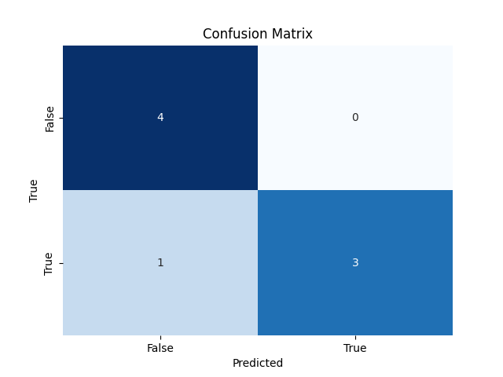

# Easy CM

A simple python package to plot confusion matrices.



## Installation

```console
foo@bar:~$ pip install easycm
```

## Usage

You can simply call the function with predictions and true values from your classification problem.

```python
from easycm import plot_confusion_matrix
import matplotlib.pyplot as plt


y_true = [False, True, True, False]
y_pred = [False, False, True, True]

plot_confusion_matrix(y_true, y_pred)
plt.show()
```

To include your confusion matrix in subplots, you can do the following

```python
from easycm import plot_confusion_matrix
import matplotlib.pyplot as plt


y_true = [False, True, True, False]
y_pred = [False, False, True, True]

fig, axs = plt.subplots(1, 2)
plot_confusion_matrix(y_true, y_pred, ax=axs[0])
plt.show()
```

You can also customize the labels for the X and Y axis and the title.

```python
from easycm import plot_confusion_matrix
import matplotlib.pyplot as plt


y_true = [False, True, True, False]
y_pred = [False, False, True, True]

plot_confusion_matrix(y_true, y_pred, title='Title', xlabel='X', ylabel='Y')
plt.show()
```